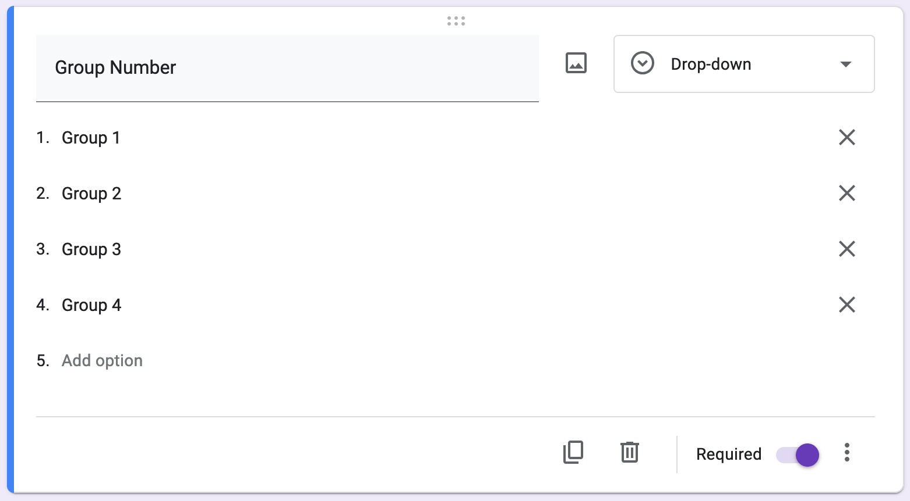
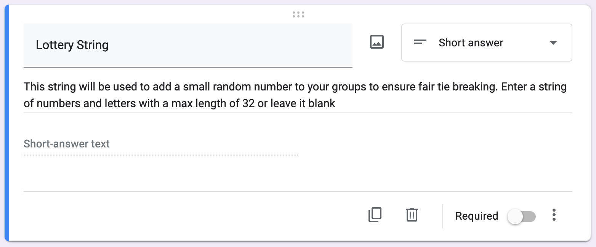
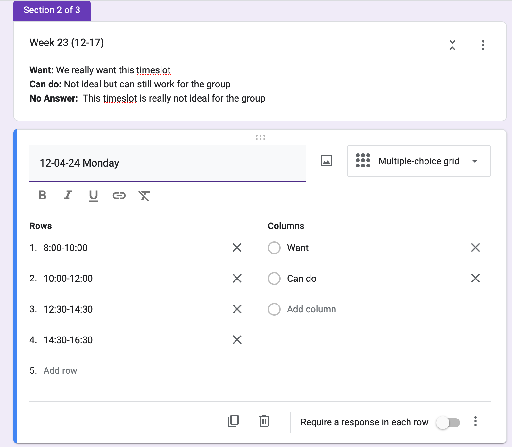
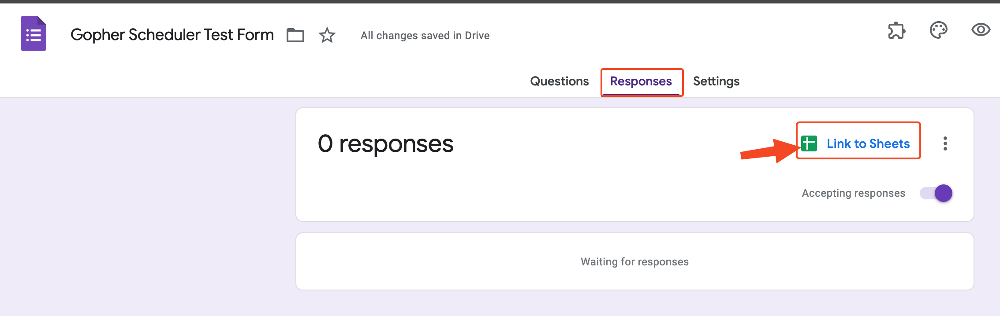
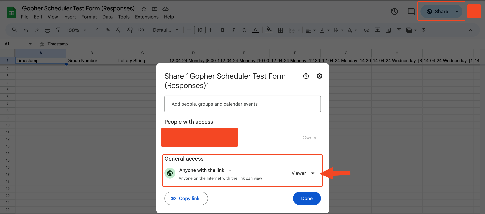

# Form layout
To use the program the google form you create has to have a certain layout below are some pictures and explanations on exactly how this should be done or use the supplied template below.  
### [Google form template](https://docs.google.com/forms/d/1RQ1kQRgOw9ZvpGbEA-T0QKUdruTd2MIOaGWJLgh2G50/template/preview)

## First
The first option should be a drop down menu with all the group names

This should be followed by a lottery string which will be used to assign pseudo random values to groups to help with tie breaking 

## Second
All following pages and sections should be formatted like so with a section description and 1 or more multiple choice grids. 1 Section can hold up to 7 multiple choice grids for each day of the week

# Google Sheets setup
Once the form is setup you need to link it to a google sheets that is set to view only with a link this will allow the program to curl fetch the data when required

You can then click view in sheets and this will bring you to the google sheets you then have to open the sharing to "view only - everybody with the link"

Now you can use the google sheets ID to run the program with this is what is referred to as the form ID. You can find the google sheets ID in the sheets URL right after the /d/

[https://docs.google.com/spreadsheets/d/formID/edit?resourcekey=&gid=379054204#gid=379054204](https://www.youtube.com/watch?v=dQw4w9WgXcQ)
